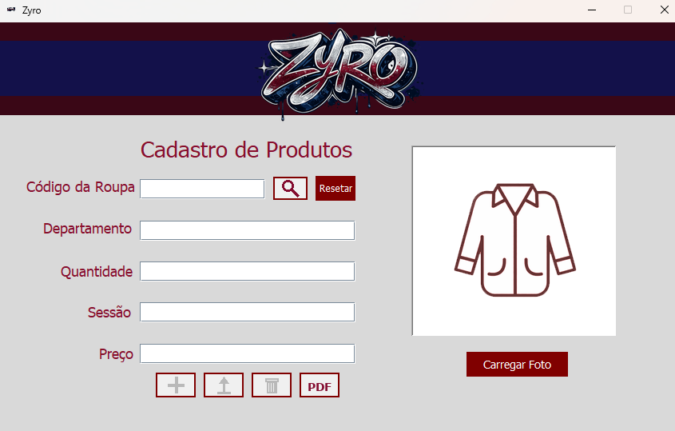

# Controle de Estoque para Loja de Roupas

Sistema de cadastro de produtos desenvolvido em Java Swing com interface gráfica, permitindo realizar operações completas de CRUD (criar, ler, atualizar e excluir). Além disso, o sistema também conta com busca de produtos, upload de imagens e geração de relatórios em PDF.

Projeto desenvolvido por mim como uma atividade de desafio, durante o curso Técnico em Informática do Senac.

---

## Interface do Sistema



---

## Funcionalidades e Tecnologias Utilizadas

As funcionalidades do sistema são:
- Cadastrar produtos  
- Editar produtos  
- Excluir produtos  
- Buscar produtos  
- Adicionar imagem ao produto  
- Gerar relatório em PDF  

As tecnologias utilizadas ao longo de seu desenvolvimento foram as seguintes:

- Java  
- Swing  
- JDBC  
- iText  

---

## Execução

1. Clone o repositório:
   ```bash
   git clone https://github.com/raykaalveshs/cadastro-produtos-java.git
